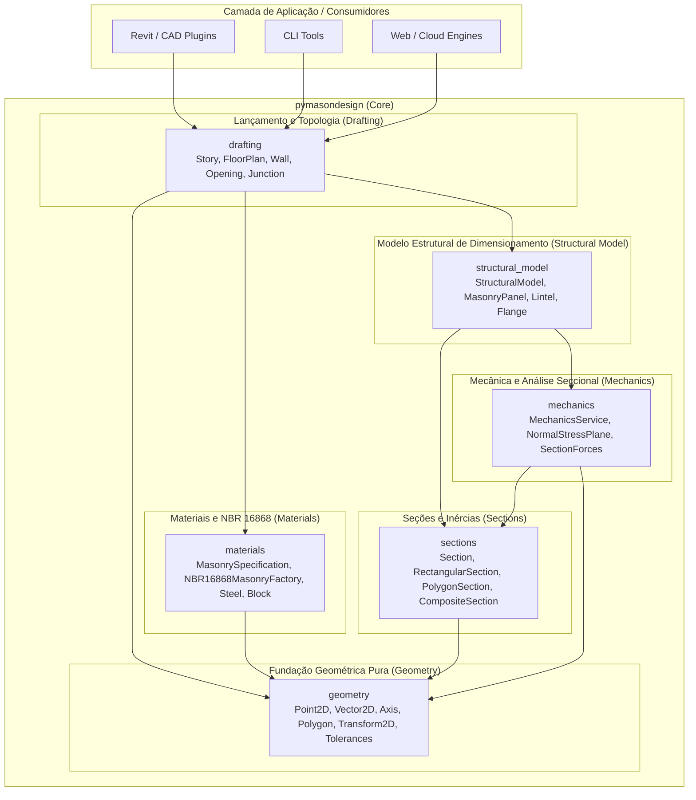
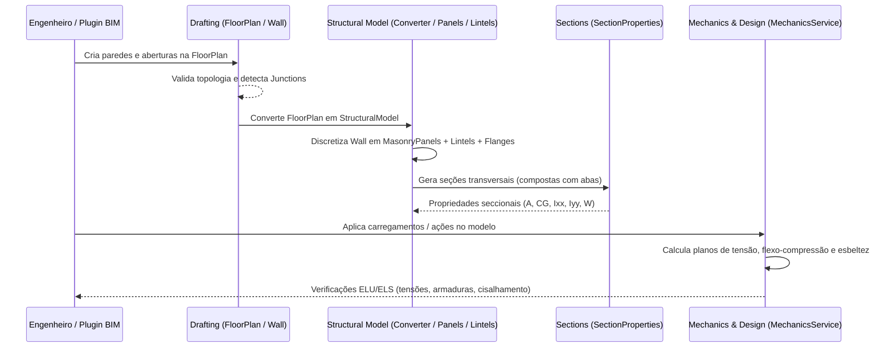

# PyMasonDesign — Arquitetura Técnica do Sistema

Este documento descreve a arquitetura de software, princípios de projeto, organização modular, modelos de domínio e decisões de engenharia do **PyMasonDesign**.

---

## 1. Visão Geral da Arquitetura

O **PyMasonDesign** foi projetado seguindo os princípios de **Domain-Driven Design (DDD)**, **Programação Funcional Imutável** e **Arquitetura em Camadas Desacopladas**. O núcleo não possui dependências de frameworks de interface gráfica, banco de dados ou engines CAD/BIM externos, garantindo máxima portabilidade, determinismo e facilidade de testes unitários.

---

## 2. Princípios Arquiteturais e Diretrizes de Design

### 2.1. Imutabilidade e Thread-Safety com `attrs`
- Todas as estruturas de dados fundamentais (`Point2D`, `Axis`, `Wall`, `FloorPlan`, `NormalStressPlane`, etc.) são decoradas com `@define` ou `@frozen` da biblioteca `attrs`.
- Instâncias são **imutáveis**. Qualquer operação de modificação retorna uma nova instância do objeto através de métodos alinhados à intenção de domínio (ex.: `floor_plan.add_wall(...)`, `floor_plan.add_opening(...)`, `axis.translated(...)`, `axis.reversed(...)`), sem mutações in-place e sem métodos genéricos `with_...`.
- Benefícios: thread-safety nativo, eliminação de efeitos colaterais (side-effects), histórico de alterações determinístico e performance otimizada com `__slots__`.

### 2.2. Tolerâncias Numéricas Centralizadas
- Cálculos geométricos e comparações de ponto flutuante utilizam o módulo centralizado `pymasondesign.geometry.tolerances`.
- É **proibido** utilizar comparações diretas de igualdade (`a == b`) para coordenadas e floats. Sempre utilizar `is_close()`, `is_zero()`, `is_within_unit()`, etc.
- Constantes padronizadas:
  - `GEOMETRIC_TOLERANCE = 1e-9`: Comparações geométricas de alta precisão.
  - `JUNCTION_TOLERANCE = 1e-4`: Detecção de encontros topológicos de paredes.
  - `OVERLAP_TOLERANCE = 1e-9`: Validação de sobreposição de vãos e aberturas.
  - `DIVISION_GUARD = 1e-15`: Proteção contra singularidades numéricas.

### 2.3. Resolução Analítica Exata
- Propriedades de seções poligonais são calculadas via fórmulas de integração de contorno (Teorema de Green / Shoelace), evitando aproximações de malha (mesh) desnecessárias.
- A integração de tensões normais lineares utiliza o **Teorema da Média**:
  $$\int_A \sigma(x, y)\, dA = A \cdot \sigma(x_{cg}, y_{cg})$$
  onde $(x_{cg}, y_{cg})$ é o centróide da seção.

---

## 3. Módulos do Sistema

### 3.1. `pymasondesign.geometry` (Geometria 2D e Tolerâncias)
Fornece primitivas vetoriais e matriciais 2D puras:
- **`Point2D`**: Coordenadas cartesianas $(x, y)$, cálculo de distâncias euclidianas e translações.
- **`Vector2D`**: Operações vetoriais (soma, subtração, produto escalar, produto vetorial 2D `cross`, rotação $90^\circ$, normalização e projeção).
- **`Axis`**: Eixo orientado no plano definido por `start` e `end`. Provê vetor diretor unitário, vetor normal, comprimento, ponto intermediário via parâmetro $t \in [0, 1]$ e detecção analítica de interseções (`intersect()`).
- **`AxisRelation` & `AxisIntersectionResult`**: Classificação de relações entre eixos (`POINT_INTERSECT`, `TOUCHING_VERTEX`, `OVERLAPPING`, `PARALLEL`, `COLINEAR`, `DISJOINT`).
- **`Transform2D`**: Transformações afins 2D representadas por matrizes homogêneas $3 \times 3$ (translação, rotação em radianos ou graus, escala).
- **`Polygon`**: Polígono 2D simples ou complexo, cálculo de área com sinal, centróide, inversão de sentido dos vértices e teste de ponto interno via *ray-casting*.
- **`BoundingBox`**: Retângulo envolvente alinhado aos eixos $(x_{\min}, x_{\max}, y_{\min}, y_{\max})$.

---

### 3.2. `pymasondesign.sections` (Seções Transversais e Inércias)
Abstração para cálculo de propriedades geométricas de seções transversais estruturais:
- **`Section`** (Classe Base Abstrata): Define o contrato `compute_properties() -> SectionProperties`.
- **`SectionProperties`**: Encapsula as propriedades calculadas da seção:
  - Área bruta ($A$).
  - Centro de Gravidade ($C_G = (x_{cg}, y_{cg})$).
  - Momentos de Inércia centrais ($I_{xx}, I_{yy}$).
  - Produto de Inércia central ($I_{xy}$).
  - Momentos Principais de Inércia ($I_u, I_v$) e ângulo de rotação principal ($\theta_p$).
  - Raios de Giração ($r_x, r_y$).
  - Módulos de Resistência Elástica ($W_x, W_y$).
- **`RectangularSection`**: Seção retangular homogênea $(b, h)$.
- **`PolygonSection`**: Seção poligonal arbitrária com cálculo analítico de $I_{xx}, I_{yy}, I_{xy}$ em relação ao centróide.
- **`CompositeSection` & `SectionComponent`**: Seção composta por múltiplos componentes (polígonos ou retângulos) com posições relativas e coeficientes de ponderação/homogeneização modular ($n = E_i / E_0$).

---

### 3.3. `pymasondesign.mechanics` (Mecânica das Estruturas e Tensões)
Implementação de modelos seccionais e análise de tensões normais:
- **`SectionForces`**: Vetor de esforços internos solicitantes seccionais ($N, M_x, M_y, V_x, V_y, T$).
- **`NormalStressPlane`**: Equação do plano linear de tensões normais:
  $$\sigma(x, y) = c_0 + c_x \cdot x + c_y \cdot y$$
- **`StressRegime`**: Classificação do estado de tensões na seção:
  - `FULL_COMPRESSION` (Totalmente comprimida: $\sigma \le 0$).
  - `PARTIAL_COMPRESSION` (Flexo-compressão com tração parcial).
  - `FULL_TENSION` (Totalmente tracionada: $\sigma \ge 0$).
  - `ZERO_STRESS` (Tensão nula em toda a seção).
- **`MechanicsService`**:
  - `calculate_normal_stress_plane(forces, properties)`: Monta o plano de tensões a partir de $N, M_x, M_y$ e da matriz de inércia da seção (resolvendo a flexo-compressão biaxial oblíqua).
  - `calculate_eccentricities(forces)`: $e_x = |M_y / N|$ e $e_y = |M_x / N|$.
  - `calculate_extreme_stresses(plane, properties)`: Tensão mínima ($\sigma_{\min}$) e máxima ($\sigma_{\max}$).
  - `classify_stress_regime(plane, properties)`: Determina o regime de tensões atuante.
  - `integrate_normal_stress(plane, section)`: Integração analítica da força normal acumulada.

---

### 3.4. `pymasondesign.materials` (Materiais e Tabelas NBR 16868)
Especificações de materiais e compósitos de alvenaria:
- **`SteelSpecification`**: Aço para armaduras passivas (CA-50, CA-60), $f_{yk}$, módulo de elasticidade $E_s = 210\,000\text{ MPa}$, cálculo de $f_{yd} = f_{yk}/\gamma_s$ e deformação de escoamento $\epsilon_{yd}$.
- **`BlockSpecification`**: Blocos de concreto ou cerâmicos (paredes vazadas ou maciças) com resistência característica $f_{bk}$.
- **`MortarSpecification`**: Argamassa de assentamento com resistência média à compressão $f_a$.
- **`GroutSpecification`**: Graute com resistência característica à compressão $f_g$ ($f_{gk}$).
- **`MasonrySpecification`**: Especificação completa do compósito bloco + argamassa + graute, contendo $f_{pk}, f_{pgk}$, resistência característica da alvenaria $f_k$ e módulo de deformação longitudinal $E_{mod}$.
- **`NBR16868MasonryFactory`**: Fábrica que encapsula as tabelas normativas da ABNT NBR 16868:
  - `concrete_from_fbk(fbk)`: Tabela 1 para blocos de concreto ($f_{bk}$ de $3.0$ a $24.0\text{ MPa}$).
  - `ceramic_hollow_from_fbk(fbk)`: Tabela para blocos cerâmicos de paredes vazadas ($f_{bk}$ de $4.0$ a $12.0\text{ MPa}$).
  - `ceramic_solid_from_fbk(fbk)`: Tabela para blocos cerâmicos de paredes maciças ($f_{bk}$ de $7.0$ a $18.0\text{ MPa}$).

---

### 3.5. `pymasondesign.drafting` (Lançamento e Topologia Estrutural)
Modelagem arquitetural e estrutural de plantas e pavimentos:
- **`Opening`**: Vão na alvenaria (portas, janelas, passagens) com largura ($w$), altura ($h$), peitoril ($sill$), elevação e posição ao longo do eixo da parede (`offset_along_wall`).
- **`Wall`**: Parede estrutural imutável definida por seu identificador (`wall_id`), eixo geométrico 2D (`axis`), espessura nominal (`thickness`), altura (`height`), lista imutável de aberturas (`openings`) e tipos de amarração nas extremidades (`start_bond`, `end_bond`).
- **`PassingWall` & `ArrivingWall`**: Representação de paredes passantes e paredes incidentes em nós de encontro.
- **`Junction`**: Nó estrutural de encontro de paredes (em L, T, X ou topo a topo), com localização topológica `point`, lista de paredes passantes e paredes incidentes.
- **`FloorPlan`**: Planta baixa de alvenaria estrutural. Agrupa as paredes, calcula comprimento total, valida sobreposições de aberturas, detecta nós de encontro (`detect_junctions()`) e valida consistência estrutural.
- **`Story`**: Pavimento estrutural com elevação $z$, altura de pé-direito $H$ e associação com uma `FloorPlan`.

---

### 3.6. `pymasondesign.structural_model` (Conversão Topológica para Modelo de Dimensionamento)
Camada de transição entre o lançamento físico (*drafting*) e o modelo analítico/numérico de cálculo:
- **`MasonryPanel` (Piers / Sub-painéis)**: Segmentos resistentes de parede contínuos delimitados por aberturas ou extremidades, associados a sua seção transversal (simples ou com abas), esbeltez efetiva e material.
- **`Lintel` (Spandrels / Vergas e Contravergas)**: Vigas de alvenaria armada ou canaleta sobre aberturas (e sob janelas) responsáveis pelo acoplamento de rigidez e transferência de cisalhamento entre painéis adjacentes.
- **`Flange` (Abas Colaborantes)**: Trechos de paredes transversais integrados aos painéis principais em nós de encontro (amarração direta ou indireta), calculados segundo a ABNT NBR 16868-1.
- **`StructuralModelConverter`**: Motor de conversão que recebe `FloorPlan` / `Story` e gera a malha/grafo estrutural com painéis, lintéis, abas e nós de acoplamento.

---

## 4. Fluxo de Dados Típico

---

## 5. Padrões de Código e Convenções

1. **Tipagem Estrita**: Todos os métodos e funções devem possuir assinaturas com type hints completos e `from __future__ import annotations`.
2. **Imutabilidade**: Nenhum atributo deve ser modificado in-place. Classes do domínio devem usar `attrs` com `frozen=True, slots=True`.
3. **Validação Eager**: Validações de domínio são disparadas no `__attrs_post_init__` ou nos métodos de fábrica (ex.: espessura $> 0$, comprimento $> 0$, aberturas dentro do comprimento da parede).
4. **Sem Efeitos Colaterais**: Funções devem ser puras sempre que possível, facilitando o reuso em cálculos paralelos e pipelines assíncronos.
